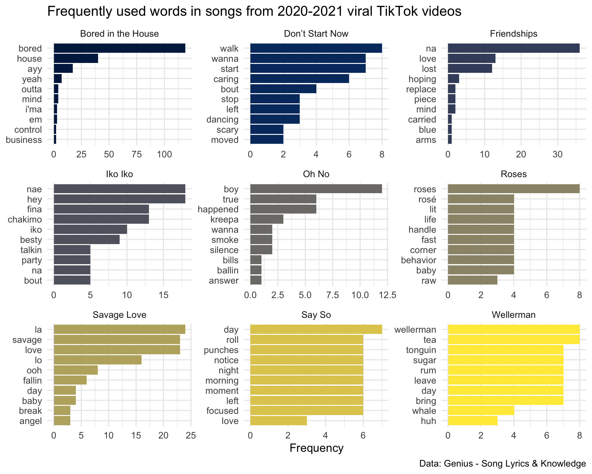
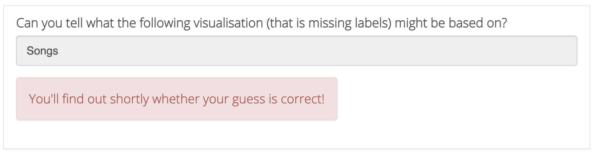

Last weekend [Maria Tackett](https://www.mariatackett.net/) and I gave an introduction to R workshop as part of the [2021 ENAR Fostering Diversity in Biostatistics Workshop](https://www.enar.org/meetings/FosteringDiversity/) for high school and undergraduate students. Our goal was to give them a taster for exploring and visualizing data with R and, hopefully, leave them wanting to learn more.

We only had 75 minutes for the workshop and a totally beginner crowd. We knew that they would be a mix of undergraduate and high school students, but didn't know much else about them as we prepared for the workshop.

I am often asked what I think about teaching R using only [learnr](https://rstudio.github.io/learnr/) tutorials and my answer is often "nope". Don't get me wrong, I love the learnr package and use it heavily in my teaching! But when I'm teaching a semester-long introduction to data science course, I think students need to learn the data science workflow as much as R syntax, which means working in the RStudio IDE and writing R Markdown documents and being aware of folder structures, projects, etc. For such courses I use learnr tutorials as a supplement, for practicing R syntax and interpretation of results, as opposed to getting the whole picture.

However, I think learnr tutorials are perfectly suited for an introduction to R workshop where you have a very limited time and especially with a beginner-level audience.

We designed two activities for this workshop: one on lyrics of songs that make an appearance in viral TikTok videos (mostly in dance challenges) and the other on data collected from the students.

## Activity 1: TikTok lyrics

To prepare this activity we first needed to pick a few songs. We decided on nine songs so that a plot faceted by song could fit in a 3x3 grid. The next task was to pick the songs, which I feel like I spent just as much time on as writing up the tutorial! I had no idea what some of the songs I am so used to hearing on TikTok videos are called. It was also challenging to find songs with limited profanity in them.

We then used the [genius](https://github.com/JosiahParry/genius) package to get their lyrics and the [tidytext](https://juliasilge.github.io/tidytext/) package to unnest the lyric data into words. At this stage we also removed things like stop words and profanity so that the workshop could focus on data visualization as opposed to data cleaning.

We started the activity with the following visualization and asked students to guess what the data might be. 

```{r fig.alt="Faceted bar plot of common words in lyrics from nine songs associated with viral TikTok videos, without any axis or plot labels.", echo = FALSE}
knitr::include_graphics("tik-tok-lyrics-unannotated.png")
```

Then worked through steps to reproduce this visualization, this time complete with labels. 

```{r fig.alt="Faceted bar plot of common words in lyrics from nine songs associated with viral TikTok videos. Same visualization as above, this time with axis and plot labels.", echo = FALSE}

```

You can find the learnr tutorial for this activity [here](https://minecr.shinyapps.io/tiktok_lyrics).

If you're interested in designing a similar learnr tutorial you might be interested in the source code for this one -- you can find it [here](https://github.com/mine-cetinkaya-rundel/enar-2021/tree/main/tiktok-lyrics). A couple notes on the source code:

- We used a [custom CSS](https://github.com/mine-cetinkaya-rundel/enar-2021/blob/main/tiktok-lyrics/css/app-style.css) for the two tutorials. Aside from a custom color scheme, this CSS file also increases the font size for the body text of the tutorial, which feels too small by default.

- We also used a [bit of JavaScript](https://github.com/mine-cetinkaya-rundel/enar-2021/blob/main/tiktok-lyrics/js/exercise-font-size.js) to increase the font size of the code in the interactive exercise boxes. You can include this in the tutorial with some raw HTML code that loads the script with `<script language="JavaScript" src="js/exercise-font-size.js"></script>`, as shown [here](https://github.com/mine-cetinkaya-rundel/enar-2021/blob/bcb33d2140316d8dc336b96e6caa1050116b7922/tiktok-lyrics/tiktok-lyrics.Rmd#L13).

- We used learnr `question()`s with `type = "text"` to get students interacting with the document early. These types of questions are notoriously not very easy to check the answers for, but in a live session, you can get away with not really checking the answers! 

```{r fig.alt="Text entry question for learnr where the feedback says 'You'll find out shortly whether your guess is correct!'", echo = FALSE}

```

## Activity 2: All about you!

For this activity we created a Google form asking students about their screen time (school/work related vs. leisure) and social media usage during the lockdown. We designed the questions such that we could get usable numerical data to display on a scatterplot, coloring the points by a categorical variable.

The learnr tutorial reads directly from the spreadsheet where Google forms collects the data, using the [googlesheets4](https://googlesheets4.tidyverse.org/) package. We created the tutorial and tested it with fake data. During the first five minutes of the workshop (during the introductions) students filled out the form and we redeployed the tutorial during the first activity so by the time they got to it, they had their own data available to them.

You can find the learnr tutorial for this activity [here](https://minecr.shinyapps.io/https://minecr.shinyapps.io/all_about_you/). 

The source code for the learnr tutorial [here](https://github.com/mine-cetinkaya-rundel/enar-2021/tree/main/all-about-you). A tip for reading in data from a Google sheet in a learnr tutorial: use [`gs4_deauth()`](https://googlesheets4.tidyverse.org/reference/gs4_deauth.html) to access public resources for which no Google sign-in is required and to suspend authorization for making requests in a non-interactive that do not require a token.

## Everything in one place

This is a useful tip for *any* workshop or course, but I think especially true for very short workshops: put everything on one page and make a short link for it. 

We organized all workshop materials at [bit.ly/enar2021](http://bit.ly/enar2021) and put this link in the Zoom chat. Remember that some Zoom setups don't allow the user to copy and paste from the chat or even click on a link on the chat, so making shortlinks is super helpful for these cases.

## Schedule 

We spent about five minutes on introduction and data collection. Then we split the time evenly between the first and second activities.

I'll be honest, it did feel a bit rushed, so if I were to do this again I might cut down on it a little bit. But the nice things is that the learnr tutorials will live on so we were able to tell the students that they can keep playing with them after the workshop.

## Feedback

We had a small group for this workshop but I think they got something out of it and the feedback at the end was quite positive! Huge thanks to the ENAR Fostering Diversity in Biostatistics Workshop organizers for inviting us to be a part of this!
