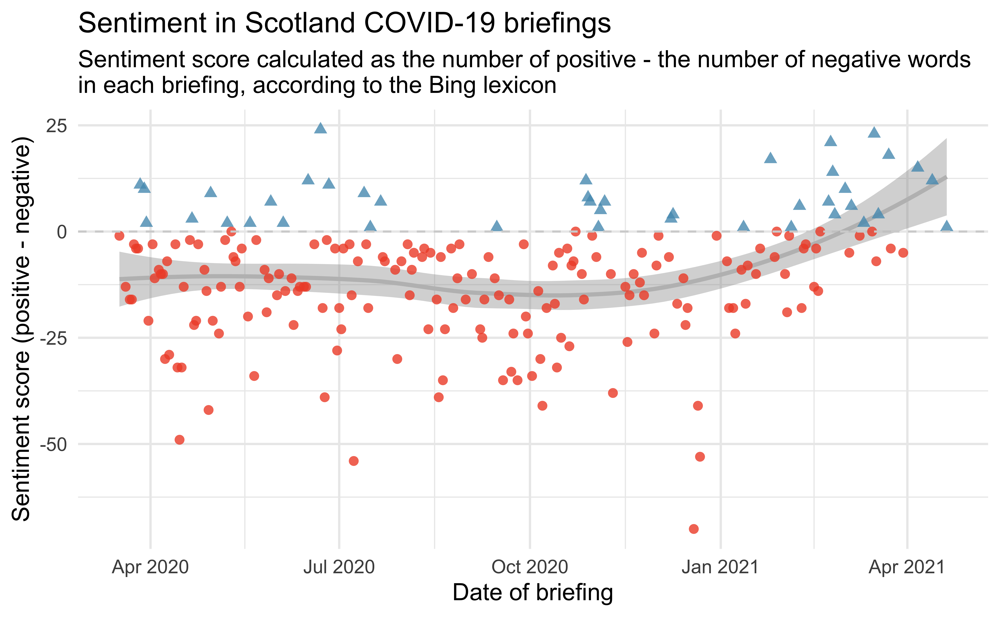

For the last year, I've watched just about every COVID-19 briefing by the Scottish Government, most of which are delivered by First Minister Nicola Sturgeon. 
Earlier on in the pandemic these were daily updates, lately it seems like once a week. 
The more often they happen, the worse you know things are going...
If I've chatted with you about COVID, you have probably heard me say that I am *very* impressed by the way she delivers these updates.
I'll be honest, they are almost boring, but in the best possible way.
The last thing I want from a leader at this time is surprises, showmanship, or claims with no scientific basis.

About a few weeks into the daily updates, I realized that the text for these speeches are published [on the Scottish Government website](https://www.gov.scot/collections/first-ministers-speeches/).
So, naturally, I downloaded the data and started analyzing it.
You can find the full analysis at [github.com/mine-cetinkaya-rundel/fm-speeches-covid19](https://github.com/mine-cetinkaya-rundel/fm-speeches-covid19).
  
It's been fun to keep coming back to this project, scraping a bit more data and looking to see how/if trends are changing. Below are a few figures from the analysis that will give you a glimpse of what it's all about.

## Highlights

### Sentiment over time

For this plot I calculated the sentiment score of each briefing as the number of words associated with a positive sentiment minus the number of words associated with a negative sentiment. Plotting sentiment scores over time shows a steady trend in the negative earlier on in the pandemic, with an upward trend towards positive since March 2021.

```{r fig.alt = "Sentiment score (calculated as number of positive minus negative words) over time. Most briefings have a negative sentiment score, with positive scores increasing in the recent past, with an upward trend since March.", echo = FALSE}

```

Code for creating this figure can be found [here](https://github.com/mine-cetinkaya-rundel/fm-speeches-covid19/blob/c18c78ee987ac4e560e7134af1d4596d151b4df1/analysis/03-visualise-scot.Rmd#L174-L189). Some notes on the code:

- I like using `shape` to distinguish groups along with `colour` by mapping the same variable to both aesthetics.
- Using custom colours is a low effort/high return way of making your plots unique, for just two colours `scale_colour_manual()` is the simplest way to achieve this.

Early on in the sentiment analysis it was clear that the sentiment assignments didn't work perfectly in this setting. For example, the word "positive" actually carries a negative sentiment in the COVID context, but it's assigned a positive sentiment in the Bing lexicon. I dropped that word from the sentiment analysis, though I realize there are a few others like it that I didn't catch/correct for.

### Social vs. physical distancing

Earlier in the pandemic Nicola Sturgeon used the phrase "social distancing", then it looks like she experimented with "physical distancing" at the beginning of the summer, and has been using that phrase exclusively ever since.

```{r fig.alt = "Number of times the phrase social distancing or physical distancing appeared in the briefings over time in Scotland briefings. Early on social distancing is used, then for a while they're both used, and then for majority of the pandemic up today, physical distancing is used.", echo = FALSE}

```

Code for creating this figure can be found [here](https://github.com/mine-cetinkaya-rundel/fm-speeches-covid19/blob/c18c78ee987ac4e560e7134af1d4596d151b4df1/analysis/03-visualise-scot.Rmd#L273-L287).

Meanwhile, down in 10 Downing Street, it's still "social distancing"... These data come from the [UK government website](https://www.gov.uk/search/all?content_purpose_supergroup%5B%5D=news_and_communications&level_one_taxon=5b7b9532-a775-4bd2-a3aa-6ce380184b6c&order=updated-newest&organisations%5B%5D=prime-ministers-office-10-downing-street&page=1&parent=prime-ministers-office-10-downing-street).

```{r fig.alt="Number of times the phrase social distancing or physical distancing appeared in the briefings over time in UK briefings. The phrase physical distancing is never used.", echo = FALSE}
knitr::include_graphics("social-physical-uk.png")
```

Code for creating this figure can be found [here](https://github.com/mine-cetinkaya-rundel/fm-speeches-covid19/blob/36dafd85ce8e005c81008452b57f334c8d9da617/analysis/06-visualise-uk.Rmd#L247-L261). 

One note on the code: In order capture "social distance" and "social distancing" (and their "physical" variants), I used `social dist|physical dist` as the regular expression to match on.^[I am now wondering if "socially distanced" or "physically distanced" might also show up, Probably should have checked for that!]

### Vaccines FTW!

This figure shows the number of times anything related to vaccinations shows up in the Scotland briefings. It occurred to me today that it's a "jab" not a "vaccine" here so I used `[Vv]accin|\\b[Jj]abs?\\b` as the regular expression string to try to catch all relevant mentions.

```{r fig.alt = "The number of times vaccinations or anything related to them has been mentioned has increased drastically since January. In some briefings in February and March vaccinations were mentioned over 25 times in a given briefing.", echo = FALSE}
knitr::include_graphics("vaccines.png")
```

Code for creating this figure can be found [here](https://github.com/mine-cetinkaya-rundel/fm-speeches-covid19/blob/c18c78ee987ac4e560e7134af1d4596d151b4df1/analysis/03-visualise-scot.Rmd#L293-L305). Some notes on the code:

- With [new advancements in graphics](https://www.tidyverse.org/blog/2021/02/modern-text-features/) it's pretty straightforward to create plots that use emojis to represent data with just ggplot2. Whether this is a great use of emojis, I'm not so sure...
- For this figure to show up in R Markdown, I used `dev = "ragg_png"` as a code chunk option.

### Still waiting for pubs...

The other thing everyone is talking about nowadays is pubs. Unfortunately, so far, mentions of pubs has been more frequently related to outbreaks than happy news.

```{r fig.alt = "Pubs were mentioned most often between August and October and most of those mentions were related to outbreaks. On August 14, 2020, pubs were mentioned 13 times, and this date corresponds to the outbreak in Aberdeen that was linked to transmission in pubs. Since October there weren't many mentions of pubs, until in the most recent briefing in April they were mentioned twice.", echo=FALSE}

```

Code for creating this figure can be found [here](https://github.com/mine-cetinkaya-rundel/fm-speeches-covid19/blob/c18c78ee987ac4e560e7134af1d4596d151b4df1/analysis/03-visualise-scot.Rmd#L311-L328). Some notes on the code: 

- Originally my gray lines covered part of the beer mug. My first instict was to shift the beer mugs (that is, `goem_text()`) up in the y direction. But then I realized I can have the mugs cover the lines simply by switching their order since ggplot2 plots the layers in order.
- `expand_limits()` might be my new favourite function. Well, it's not new, but new to me, somehow... It allows you to ensure a single value is included in the limits without having to worry about whether it would be included or not automatically. If included, ggplot2 doesn't change anything. If not, it extends the limit to that value. 

### Scotland vs. UK speeches

The following figure shows the tf-idf (term frequency - inverse document frequency) scores of words in Scotland and UK speeches. 
Some of the words that show up more in Scotland briefings and much fewer (or no) times in UK briefings are geographic areas in Scotland, which makes sense.
Nicole Sturgeon also regularly qualifies statistics she reports (e.g. positive cases, deaths, etc.) with the phrase "by that measurement", and that's probably why the word "measurement" shows up on the Scotland side.
Some differences are harder to explain. 
Except "slides", they say "next slide please" a lot in the UK briefings!
Nicola Sturgeon doesn't use slides, so none of that up here.

```{r fig.alt="Words with high tf-idf for Scotland speeches are (in decreasing order) registered, Glasgow, suspected, Aberdeen, usual, measurement, issues, Lanarkshire, Clyde, either, Lothian, presiding, decrease, relation, reminder. Words with high tf-idf for UK speeches are (in decreasing order) slide, speaker, adjusting, fatalities, doctors, kingdom, alas, roadmap, mechanical, gov.uk, Merseyside, Mancherter's, mayor, amazing, department ", echo = FALSE}
knitr::include_graphics("tf-idf.png")
```

Code for creating this figure can be found [here](https://github.com/mine-cetinkaya-rundel/fm-speeches-covid19/blob/36dafd85ce8e005c81008452b57f334c8d9da617/analysis/08-visualise-compare.Rmd#L91-L102). One note on the code: The blue used in the Scotland plot is the blue from the Scottish flag and the red in the UK plot is the red from the UK flag. Again, this is a point about using custom colours, and in this case, contextual colours.

### Text classification models

This case study was a great motivator for me to learn more about tidymodels and also text modeling. 
I am hugely grateful for the fantastic [tidymodels learning resources](https://www.tidymodels.org/learn/) as well as this [tidy text modeling tutorial](https://emilhvitfeldt.github.io/useR2020-text-modeling-tutorial/#1) by Julia Silge and Emil Hvitfeldt. 
The details of the model building are can be found [here](https://github.com/mine-cetinkaya-rundel/fm-speeches-covid19/blob/master/analysis/11-predict-downsample.R) but I'll show one figure summarizing the results in this post -- the variable importance figure.

These are text features that have high importance in the classification model. 
Some of them match findings from the tf-idf plot above, but in the model I also used bigrams and trigrams, so you see some phrases as well as single words as well.
"Physical distancing" shows up on the Scotland side, which makes sense based on the social vs. physical distancing finding from earlier. 
I can almost hear in my head Nicola Sturgeon talking about losing a "loved" one, I think she uses this phrasing in every briefing, so that word also makes sense to me.
On the UK side, we have "slide" again, which makes me think I should have removed all the "next slide please" sentences.
There is also "livelihoods" and upon closer inspection of the texts I think this is due to phrases like *"we are engaged in a constant struggle to protect lives and livelihoods"* being more common in the UK briefings than in the Scotland briefings.
If what you know about Scotland is limited to [Braveheart](https://www.youtube.com/watch?v=k7rPOaoPL4I&ab_channel=BestMoviesByFarr), the word "freedom" showing up on the UK side might surprise you.
Both countries' briefings mention "freedom", but it shows up a lot more often in the UK briefings, within sentences like *"and i must stress that it is only because of months of sacrifice and effort that we can take this small step to freedom today."*.

```{r fig.alt="Variable importance for text features from the model. 40 features per country of origin are presented. The interesting features are discussed in the text above.", echo=FALSE}
knitr::include_graphics("vip.png")
```

Code for creating this figure can be found [here](https://github.com/mine-cetinkaya-rundel/fm-speeches-covid19/blob/36dafd85ce8e005c81008452b57f334c8d9da617/analysis/11-predict-downsample.R#L214-L234).

## Venues

What started as a side project ended up being a useful resource for a few more things. 
I've used this case study in a few other venues:

- For teaching (all materials on Data Science in a Box, videos included):
  - Writing a function to scrape a page: [Unit 2 - Deck 21](https://datasciencebox.org/exploring-data.html)
  - Iterating over many pages: [Unit 2 - Deck 22](https://datasciencebox.org/exploring-data.html)
  - Text analysis: [Unit 5 - Decks 1 and 2](https://datasciencebox.org/looking-forward.html)
  - Shiny: [Unit 5 - Deck 3](https://datasciencebox.org/looking-forward.html)
  - Machine learning / text classification models: [Unit 5 - Deck 4](https://datasciencebox.org/looking-forward.html)
- In talks:
  - TwinCities WIMLDS - Mar 2021 [[slides]](https://mine-cetinkaya-rundel.github.io/fm-speeches-covid19/venues/twincities-wimlds/tidyverse-tidymodels.html#1)
  - R-Ladies Edinburgh + edinbR - April 2021 [[slides]](https://mine-cetinkaya-rundel.github.io/fm-speeches-covid19/venues/edi-rladies-edinbr/thats-what-nicola-said.html#1)

## Find out more

If you'd like to dig in to the code yourself, you can find it all in [this GitHub repo](https://github.com/mine-cetinkaya-rundel/fm-speeches-covid19).

I might keep scraping the data for a bit longer and update the analysis, but I sure am looking forward to the day when there are no further COVID briefings!
